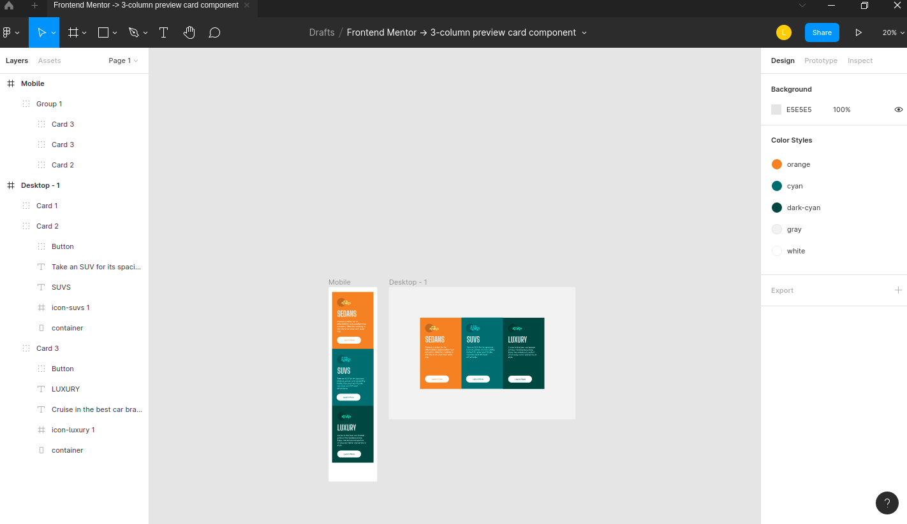
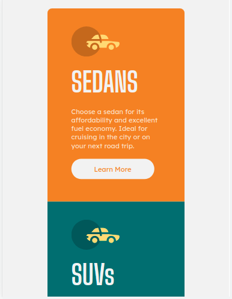

# Frontend Mentor - 3-column preview card component solution

This is a solution to the [3-column preview card component challenge on Frontend Mentor](https://www.frontendmentor.io/challenges/3column-preview-card-component-pH92eAR2-). Frontend Mentor challenges help you improve your coding skills by building realistic projects.

### O Desafio

Users should be able to:

- View the optimal layout depending on their device's screen size
- See hover states for interactive elements

### Screenshots

  <h1 align="center">
  Figma
    

  

  <h1 align="center">
  Destkop
      

  

  <h1 align="center">
  Mobile
    
  
</h1>
</h1>

### Links

- [Solution URL](https://www.frontendmentor.io/solutions/htmlcss-preview-card-with-mobilefirst-vdp99MLEW)
- [Deploy](https://front-end-mentor-column-preview-card.vercel.app/)
- [Design no Figma](https://www.figma.com/file/yokpevdU4Z7D5VnjKzBzwr/Frontend-Mentor-3-column-preview-card-component?node-id=0%3A1)

## My process

First i make a design prototype in figma based in photos from the challenge. It was a very good practice to using figma.
After, I started the code by creating arquives and HTML structure in index.html
In the styles.css, I organized the style with variables that represent the defined colors. SO i followed the entire development process using the mobile-first workflow, where we build first for mobile and then for destkop.

### Build with

- HTML
- CSS
- Flexbox
- Mobile-first workflow

## Author

- Github - [Lucas Rosa](https://github.com/Bluniz)
- Frontend Mentor - [@Bluniz](https://www.frontendmentor.io/profile/Bluniz)
- Twitter - [@blunizdev](https://twitter.com/blunizdev)
